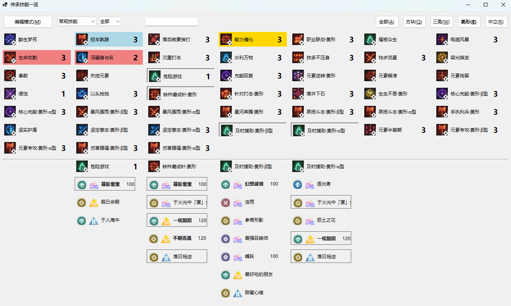

# MarkMaster

## 项目简介

MarkMaster 是一个用于维护《白荆回廊》漫巡刻印基点技能的系统。
该项目基于 C# 和 .NET 9.0 开发。

## 功能特性

- **WIKI数据抓取**：从WIKI抓取技能数据、烙痕数据、角色数据，并保存一些图片资源到本地文件。
- **用户数据**：加载并保存维护本地用户数据。包括用户的技能等级和用户的技能标签。

## 使用说明

1. **启动爬虫**：点击主界面的“更新技能烙痕资源”按钮，系统将依次抓取技能、记忆烙痕和角色数据，并下载相关图片资源。
2. **查看技能**：点击“传承技能一览”按钮，打开技能查看界面。

   - **鼠标悬停**：展示技能所属的烙痕和相关队长技。加粗的烙痕为拥有“技能解锁提升”效果的烙痕，右侧的数值为它的概率。
   - **技能筛选**：支持按技能类型、等级和名称进行筛选。
   - **编辑模式**：点击左上角的按钮进入编辑模式，<span style="color:#FF4444;">左键提高技能等级</span>，<span style="color:#FF4444;">右键降低技能等级</span>。单击保存会记录所有技能的等级，等级会存储到本地json文件中。
   - **技能标签**：<span style="color:#FF4444;">使用“CTRL/ALT/SHIFT+左键/右键”的组合键可以对技能进行分类标签</span>，一共六种标签，分别对应不同的颜色。再点一次相同的组合键可以取消标注。标注会存储到本地json文件中。
   - **漫巡烙痕选择**：非编辑模式下，左键单击技能会将技能加入下方的候选列表，再次单击（或右键单击下方列表中的候选技能列头）可以取消之。依次展示所有技能的烙痕，重复的烙痕会用方框圈出来。漫巡过程中可以优先选择方框圈出的重复的烙痕，以及拥有“技能解锁提升”效果的烙痕。
3. **导入数据**：点击“导入数据”按钮，打开数据导入界面。
   - 输入技能名，每行一个，结尾可以用空格+1/2的数字来标注等级。未标注等级的技能视为3级。成功匹配的技能对应的行会被删除，所有未成功匹配的技能的文本会保留在框内，你可以更改文本，或回到技能展示页面使用编辑功能以手动更改匹配失败的技能名。
例如：
```markdown
    星河奔腾方块
    一线生机 1
    元素逆转方块 2
    元素专攻方块alpha
```

## 开发环境

- **编程语言**：C#
- **框架**：.NET 9.0
- **开发工具**：Visual Studio 2022

## 作者

ITX351

## 致谢

特别感谢 GitHub Copilot 对本项目开发的帮助。